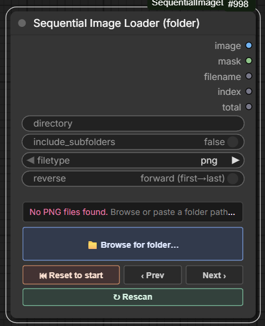

# Sequential Image Loader

**Load a folder of images one at a time, in order — a fresh image on every Queue.** Paste a directory path, hit Queue, and the node hands back the next file in the folder. Queue again and it advances. No rewiring between runs, no `index` widget to bump by hand. Built for batch-processing a folder of frames or photos through any ComfyUI workflow.

<a href="https://buymeacoffee.com/lorasandlenses"></a>



## What it does

```
   ┌──────────────────────────────────────┐
   │   Sequential Image Loader (folder)    │
   │  directory: [ C:\frames\ ........... ] │
   │  filetype:  [ png ▾ ]   subfolders ☐  │
   │  reverse:   [ forward (first→last) ]  │
   │  ┌──────────────────────────────────┐ │
   │  │ Next: 3 / 240 · frame_003.png    │ │ ← live status
   │  ├──────────────────────────────────┤ │
   │  │ [⏮ Reset] [‹ Prev] [Next ›] [↻]  │ │ ← controls
   │  └──────────────────────────────────┘ │
   └───────────────┬──────────────────────┘
                   │
        image · mask · filename · index · total
```

Drop the node on the canvas, point it at a folder, wire **image** (and **mask** if you need it) into your graph, and Queue. Each Queue loads the next image; when it reaches the end it loops back to the start. That's the whole idea.

## Why you'd want it

The usual way to run a workflow over a folder of images is to swap the file in **Load Image** by hand between every run, or to build a batch-loader contraption that fires everything at once and floods your VRAM. This sits in the middle: it's a normal single-image loader that just **remembers where it got to** and steps forward each time you press Queue.

- **One image per Queue.** Process a folder at your own pace — tweak settings between runs, watch each result, stop whenever.
- **📁 Browse for folder** — a built-in folder picker (browses the ComfyUI server's filesystem) so you don't have to hand-type paths. Or just paste a path.
- **Natural sort order.** `frame2.png` comes before `frame10.png`, the way you'd expect — not `frame10` before `frame2`.
- **⏮ Reset to start** rewinds to the first image. **‹ Prev / Next ›** step the position without queuing. **↻ Rescan** re-reads the folder after you add or remove files.
- **Pick your filetype** — `png`, `jpg`, `jpeg`, `webp`, `bmp`, `gif`, `tiff`, or `all` for every supported type at once.
- **Reverse** runs the sequence last→first.
- **Live status line** shows exactly where you are: `Next: 3 / 240 · frame_003.png`.

## Install

Clone into your `ComfyUI/custom_nodes/`:

```bash
cd ComfyUI/custom_nodes/
git clone https://github.com/shootthesound/ComfyUI-SequentialImageLoader.git
```

Restart ComfyUI. No extra Python dependencies — it uses Pillow and torch, which ComfyUI already ships.

## Quick start

1. Add **Sequential Image Loader (folder)** from the `image` category.
2. Set the folder: click **📁 Browse for folder…** and pick one, or paste a path into **directory** (e.g. `C:\frames\` or `/home/me/frames`).
3. Pick a **filetype** (`png` by default; `all` grabs every supported type).
4. (Optional) tick **include_subfolders** to walk subfolders too, or flip **reverse** to go last→first.
5. Wire **image** (and **mask**) into your workflow.
6. **Queue.** It loads the first image. Queue again → the next. And so on.

The status line shows `Next: N / TOTAL · filename`. Hit **⏮ Reset to start** any time to begin again from the first file.

## Controls

| Control | What it does |
|---|---|
| **directory** | Folder to scan. Paste an absolute path, or use **📁 Browse**. |
| **📁 Browse for folder…** | Server-side folder picker — navigate the filesystem and pick a folder (shows how many matching files each folder holds). |
| **filetype** | `png` (default), `jpg`, `jpeg`, `webp`, `bmp`, `gif`, `tiff`, or `all`. `jpg`/`jpeg` both match `.jpg` and `.jpeg`; `tiff` matches `.tif`/`.tiff`. |
| **include_subfolders** | Walk subfolders recursively (sorted by path relative to the folder). |
| **reverse** | Run the sequence last→first instead of first→last. |
| **⏮ Reset to start** | Rewind to the first image in the current order. |
| **‹ Prev / Next ›** | Step the position back/forward **without** queuing. |
| **↻ Rescan** | Re-read the folder (after adding/removing files). |

## Outputs

| Output | Type | Notes |
|---|---|---|
| `image` | IMAGE | RGB, EXIF-rotated, `[1, H, W, 3]` float32 |
| `mask` | MASK | from the alpha channel (inverted, same as ComfyUI's Load Image); zeros if no alpha |
| `filename` | STRING | basename of the loaded file |
| `index` | INT | 0-based position used this run |
| `total` | INT | number of matching files found |

## How "advance per Queue" works

ComfyUI only re-runs a node when one of its inputs changes, so a hidden `index` widget drives the position. A small frontend hook on `app.queuePrompt` increments that widget **after** each prompt has been serialized and sent — so the run you just queued uses the *current* image, and the next Queue picks up the following one. **Reset** and **Prev/Next** just set that widget directly. When the index passes the last file it wraps back to the start.

## Honest limits

- **Position is per-session widget state.** It's stored on the node and saved with your workflow JSON, so reopening a graph resumes where you left off — but external tools that re-run the workflow headless start from whatever index was saved.
- **One queue = one image.** This is a deliberately manual, paced loader. If you want every image processed in a single Queue, that's a different (batch) node.
- **Changing filetype mid-run keeps the index number.** If the new type has fewer files it wraps via modulo — hit **Reset** after switching type to start cleanly from the first file of the new set.

## Compatibility

- **ComfyUI:** any reasonably modern version (the JS uses standard ComfyUI extension APIs).
- **Formats:** PNG, JPG/JPEG, WebP, BMP, GIF, TIFF (anything Pillow can open).
- **OS:** Windows, macOS, Linux — paste paths in your platform's native form.

## Credits + contact

Built by Peter Neill ([shootthesound](https://github.com/shootthesound)).

Bug reports and feature requests welcome via GitHub issues.

If this saves you time, you can support development here:

<a href="https://buymeacoffee.com/lorasandlenses"></a>

## License

MIT.
